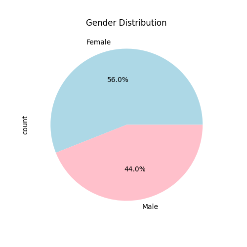
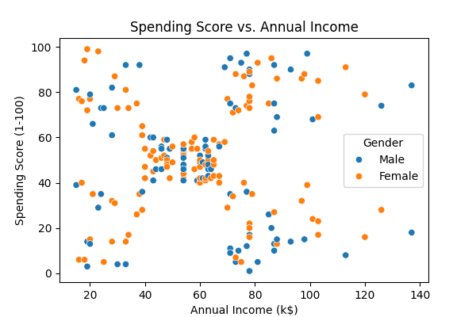

# 🏆 Prodigy Task 02 - Machine Learning Project

## 📌 Project Overview  
This project involves customer segmentation using machine learning techniques on the **Mall Customers dataset**.  
We apply **K-Means Clustering** and other algorithms to analyze customer purchasing behavior.


## 📂 Dataset  
- **Mall_Customers.csv**: Contains customer data such as Age, Gender, Annual Income, and Spending Score.  

## ⚙️ Installation  
Follow these steps to set up and run the project:  

1. **Clone this repository:**  
   ```sh
   git clone https://github.com/PradeepthiPonna/kmeans-clustering-based-on-customers-purchase-behaviour
   ```

2. **Navigate to the project folder:**  
   ```sh
   cd ML-Projects
   ```

3. **Install dependencies:**  
   ```sh
   pip install -r requirements.txt
   ```

## 🚀 Usage  
Run the Jupyter Notebook:  
```sh
jupyter notebook Prodigy-Task02-ML.ipynb
```

## 📊 Libraries Used  
- NumPy  
- Pandas  
- Scikit-learn  
- Matplotlib  
- Seaborn  

## 📈 Visualizations  
The project includes the following visualizations to understand customer segmentation:  
- **Gender Distribution** (Pie Chart)  
- **Annual Income Distribution** (Histogram)  
- **Spending Score vs. Annual Income** (Scatter Plot)  
- **Clustered Customer Segments** (K-Means visualization)  

Here are some sample plots generated in the analysis:  

### **1️⃣ Gender Distribution**  
  

### **2️⃣ Annual Income Distribution**  
  

### **3️⃣ Spending Score vs. Annual Income**  
  

### **4️⃣ K-Means Clustered Segments**  
  


## 🛠️ Features  
- Customer Segmentation using **K-Means Clustering**  
- Data Visualization and Exploratory Data Analysis (EDA)  
- Model evaluation and insights  

## 💡 Project Structure  
```
📁 ML-Projects  
│── 📄 Prodigy-Task02-ML.ipynb   # Jupyter Notebook with ML analysis  
│── 📄 Mall_Customers.csv        # Dataset file  
│── 📄 requirements.txt          # Dependencies  
│── 📄 README.md                 # Project documentation  
│── 📁 images                    # Folder containing visualization images  
```

## ✨ Author  
[PRADEEPTHI PONNA](https://github.com/PradeepthiPonna)

## 📜 License  
This project is licensed under the **MIT License**.  
